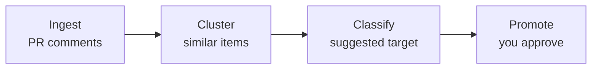

<div align="center">

<h1>promote-cli</h1>

<p><strong>Turn repeated AI review comments into durable repository memory.</strong></p>

<p>
  <a href="#why-promote-cli">Why</a> ·
  <a href="#how-it-works">How</a> ·
  <a href="#quick-start">Quick start</a> ·
  <a href="#what-makes-it-different">Features</a> ·
  <a href="#cli-reference">CLI</a> ·
  <a href="#roadmap">Roadmap</a>
</p>

<p>
  <a href="https://www.npmjs.com/package/promote-cli"></a>
  <a href="https://www.npmjs.com/package/promote-cli"></a>
  
  <a href="https://github.com/gyulsbox/promote/blob/main/LICENSE"></a>
</p>

</div>

<br />

CodeRabbit, Copilot, and Claude review your PRs — and the same suggestions keep coming back. **promote-cli** mines repeated review comments across your PR history, clusters them into patterns, and helps you promote each into a rule your AI tools will read on the next review.

<div align="center">

<table>
<tr>
<td align="center"><sub><code>promote init</code></sub><br></td>
<td align="center"><sub><code>promote scan</code></sub><br></td>
</tr>
</table>

</div>

```bash
npm i -g promote-cli
promote init
promote scan --since 30d
```

<br />

## Why promote-cli

AI review tools leave comments on PRs. Developers resolve them and move on. The decision disappears into a closed PR thread.

But some of those comments aren't just about the current diff — they reveal **implicit knowledge** that the repository doesn't have written down. A convention no one documented. An architectural decision no one recorded. An invariant no one tested.

If the same comment appears next week, the team pays the same review cost again. AI agents now read your repo's instructions (`CLAUDE.md`, `AGENTS.md`, `.cursor/rules/`) — but no tool helps you keep those instructions in sync with what your reviewers actually flag.

> *"The human reviewer's role is no longer to trace code details, but to measure the distance between decisions and implementation."*

The name *promote* reflects that shift: review comments aren't disposable noise — they're **knowledge waiting to be elevated** into your repo's durable memory. The decision still yours is *where* it belongs.

|                              | Without any tool          | Hand-writing AGENTS.md     | With promote-cli                |
| ---------------------------- | ------------------------- | -------------------------- | ------------------------------- |
| Capture repeated patterns    | ❌ Lost in closed PRs     | ⚠️ Whatever you remember   | ✅ Mined from review history    |
| Cluster duplicates           | ❌ Same comment, weekly   | ⚠️ Manual                  | ✅ Embedding + LLM hybrid       |
| Route to the right file      | —                         | ⚠️ You guess               | ✅ Suggested target             |
| Human approval               | —                         | ✅                         | ✅ Required per candidate       |
| Evidence trail to PRs        | —                         | ❌                         | ✅ Links to source comments     |
| Cost                         | —                         | Free / hours of yours      | $0.07–$0.47 per scan            |

<br />

## How it works



- **Ingest** — pulls AI bot review comments + human replies + 👍/👎 reactions from your repo's PR history
- **Cluster** — groups similar comments using embedding+HAC (`quick`) or LLM-direct (`broad`) — pick with `--mode`
- **Classify** — picks a target: agents-level rule, path-scoped rule, ADR, test recommendation, or `none`
- **Promote** — drafts a patch, links the source comments, hands it to you to approve

Conservative by default — every promotion is human-confirmed, and low-confidence patterns route to `none` instead of guessing.

<br />

## Quick start

**Install.**

```bash
npm i -g promote-cli
```

**1. Initialize.** Interactive setup — pick provider (OpenAI / Anthropic / Google), AI tool target (Claude Code / Codex / Copilot / Cursor / Windsurf / Gemini), and output language.

```bash
promote init
```

**2. Scan.** Ingest comments, cluster, classify, then enter interactive review.

```bash
promote scan --since 30d
```

**3. Review.** Approve, ignore, or snooze each candidate — approved ones land in your chosen target file immediately.

```
─── Candidate 1/7 ───

React hooks should use named imports instead of default imports

Target      path_scoped_rule → .claude/rules/react-imports.instructions.md
Confidence  0.85
Occurrences 3 across 2 PRs

> Promote → path_scoped_rule
> Promote (different target)
> Show full patch
> Skip
```

BYOK — you bring your own API key. promote never proxies through a server.

**4. (optional) Save a digest.** Pass `--out` to write the scan results as a markdown summary — handy for PR descriptions, weekly review threads, or CI artifacts.

```bash
promote scan --since 30d --out promote-digest.md
```

Output is localized per `language.preferredOutput` in `.promote.yml` (en / ko / ja).

<br />

## What makes it different

- **Hybrid clustering.** Embedding+HAC pre-cluster is cheap (~$0.07/scan); LLM refinement only on borderline pairs — accurate without paying for LLM-on-every-comment. Switch with `--mode quick|broad`. ([details](docs/clustering.md))
- **Multi-tool aware.** Routes the same finding to `CLAUDE.md`, `AGENTS.md`, `.github/copilot-instructions.md`, `.cursor/rules/`, `.windsurf/rules/`, or `GEMINI.md` — pick at `init`, change anytime.
- **Multi-provider BYOK.** OpenAI, Anthropic, or Google. No hosted backend, no proxy. Free tier available on Google.
- **Reads human signal.** Picks up reply threads ("this is intentional"), 👍/👎 reactions, and reviewer agreement; boosts confidence when 2+ reviewers concurred, flags `needsHumanDecision` when the original commenter walked it back.
- **Evidence trail.** Every promoted rule links back to the PR comments it came from — auditable, not vibes.
- **Stable candidate IDs.** Same pattern keeps the same ID across rescans, so deferred decisions don't get lost on the next run.
- **Secret redaction.** AWS keys, tokens, JWTs stripped before any LLM call.

<br />

## CLI reference

| Command                                                                | What it does                                                  |
| ---------------------------------------------------------------------- | ------------------------------------------------------------- |
| `promote init`                                                         | Interactive setup — provider, tool, language, memory paths    |
| `promote scan [--since 30d] [--mode quick\|broad] [--repo owner/repo] [--out file.md]` | Fetch → cluster → classify → interactive review (`--out` writes a markdown digest) |
| `promote review`                                                       | Re-review all pending (snoozed/deferred) candidates           |
| `promote <id>` `[--target adr]`                                        | Apply one specific candidate with confirm prompt              |
| `promote ignore <id> [--reason "..."]`                                 | Dismiss permanently                                           |
| `promote snooze <id> [--days 30]`                                      | Resurface later                                               |
| `promote --help`                                                       | All flags                                                     |

<br />

## Configuration

`promote init` writes a minimal `.promote.yml` you rarely need to touch.

```yaml
version: 2
language:
  preferredOutput: en
memoryTargets:
  agents:
    preferredFiles: [CLAUDE.md]
  pathScoped:
    preferredDir: .claude/rules
thresholds:
  minOccurrences: 2
  windowDays: 60
  minConfidence: 0.75
llm:
  provider: anthropic
  classificationModel: claude-haiku-4-5
```

Full schema, per-provider defaults, env vars, and routing taxonomy → [docs/config.md](docs/config.md).

<br />

## Roadmap

**Shipping today** — Personal CLI, multi-tool routing, hybrid clustering, human reply/reaction signal, stable IDs, secret redaction, i18n digest (en / ko / ja).

**Next** — `--create-pr` headless mode + GitHub Action template for weekly digest PRs.

**Later** — MCP server (use promote from Claude Code / Codex / Copilot directly), eval command for classification accuracy, memory health checks, hosted GitHub App.

<br />

## License

MIT

> *promote doesn't generate more review comments. It reduces repeated ones over time.*
