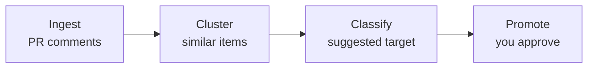

<div align="center">

<h1>promote-cli</h1>

<p><strong>Turn repeated AI review comments into durable repository memory.</strong></p>

<p>
  <a href="#why-promote-cli">Why</a> ·
  <a href="#how-it-works">How</a> ·
  <a href="#quick-start">Quick start</a> ·
  <a href="#what-makes-it-different">Features</a> ·
  <a href="#cost--mode-trade-off">Cost</a> ·
  <a href="#cli-reference">CLI</a> ·
  <a href="#roadmap">Roadmap</a>
</p>

<p>
  <a href="https://www.npmjs.com/package/promote-cli"></a>
  <a href="https://www.npmjs.com/package/promote-cli"></a>
  
  <a href="https://github.com/gyulsbox/promote/blob/main/LICENSE"></a>
</p>

</div>

<br />

CodeRabbit, Copilot, and Claude review your PRs — and the same suggestions keep coming back. **promote-cli** mines repeated review comments across your PR history, clusters them into patterns, and helps you promote each into a rule your AI tools will read on the next review.

<div align="center">

<table>
<tr>
<td align="center"><sub><code>promote init</code></sub><br></td>
<td align="center"><sub><code>promote scan</code></sub><br></td>
</tr>
</table>

</div>

```bash
npm i -g promote-cli
promote init
promote scan --since 30d
```

<br />

## Why promote-cli

AI review tools leave comments on PRs. Developers resolve them and move on. The decision disappears into a closed PR thread.

But some of those comments aren't just about the current diff — they reveal **implicit knowledge** that the repository doesn't have written down. A convention no one documented. An architectural decision no one recorded. An invariant no one tested.

If the same comment appears next week, the team pays the same review cost again. AI agents now read your repo's instructions (`CLAUDE.md`, `AGENTS.md`, `.cursor/rules/`) — but no tool helps you keep those instructions in sync with what your reviewers actually flag.

> *"The human reviewer's role is no longer to trace code details, but to measure the distance between decisions and implementation."*

The name *promote* reflects that shift: review comments aren't disposable noise — they're **knowledge waiting to be elevated** into your repo's durable memory. The decision still yours is *where* it belongs.

|                              | Without any tool          | Hand-writing AGENTS.md     | With promote-cli                |
| ---------------------------- | ------------------------- | -------------------------- | ------------------------------- |
| Capture repeated patterns    | ❌ Lost in closed PRs     | ⚠️ Whatever you remember   | ✅ Mined from review history    |
| Cluster duplicates           | ❌ Same comment, weekly   | ⚠️ Manual                  | ✅ Embedding + LLM hybrid       |
| Route to the right file      | —                         | ⚠️ You guess               | ✅ Suggested target             |
| Human approval               | —                         | ✅                         | ✅ Required per candidate       |
| Evidence trail to PRs        | —                         | ❌                         | ✅ Links to source comments     |
| Cost                         | —                         | Free / hours of yours      | $0.07–$0.47 per scan            |

<br />

## How it works



- **Ingest** — pulls AI bot review comments + human replies + 👍/👎 reactions from your repo's PR history
- **Cluster** — groups similar comments using embedding+HAC (`quick`) or LLM-direct (`broad`) — pick with `--mode`
- **Classify** — picks a target: agents-level rule, path-scoped rule, ADR, test recommendation, or `none`
- **Promote** — drafts a patch, links the source comments, hands it to you to approve

Conservative by default — every promotion is human-confirmed, and clusters dropped during classify (low confidence, not promotable, already handled) surface in the digest's `Filtered out` appendix with the classifier's reasoning, instead of being silently discarded.

<br />

## Quick start

**Install.**

```bash
npm i -g promote-cli
```

**1. Initialize.** Interactive setup — pick provider (OpenAI / Anthropic / Google), AI tool target (Claude Code / Codex / Copilot / Cursor / Windsurf / Gemini), and output language.

```bash
promote init
```

**2. Scan.** Ingest comments, cluster, classify, then enter interactive review.

```bash
promote scan --since 30d
```

**3. Review.** Walk through each candidate — promote or skip per item. Approved ones land in your chosen target file immediately.

```
─── Candidate 1/7 ───

React hooks should use named imports instead of default imports

Target      path_scoped_rule → .claude/rules/react-imports.instructions.md
Confidence  0.85
Occurrences 3 across 2 PRs

> Promote → path_scoped_rule
> Promote (different target)
> Show full patch
> Skip
```

After the candidates, if anything was filtered out during classify you can browse those too, and any candidates you skipped can be appended to the digest for team review:

```
Also walk through 4 skipped item(s)?
> Walk through them one by one
> Skip all

─── Skipped 1/4 ───

Tests should import vitest helpers explicitly

Reason      below confidence threshold
Target      agents
Confidence  0.62
Detail      Pattern only appeared in 2 PRs; below minConfidence threshold

> Next
> Skip remaining

Add 2 skipped candidate(s) to digest for team review? (Y/n)
```

For permanent dismissal or deferral outside the interactive flow, use `promote ignore <id>` or `promote snooze <id>` directly.

BYOK — you bring your own API key. promote never proxies through a server.

**4. (optional) Save a digest.** Every `promote scan` writes a digest to `docs/promote/digests/{date}.md` by default — pass `--out` to override the path. The directory sits inside `docs/` so digests can be committed alongside the memory PR (the `--create-pr` flow bundles the digest into the same commit). The digest carries the promotion candidates plus a `Filtered out` appendix listing every cluster the classifier dropped (with its reason), and a `Skipped during review` section if you deferred candidates during interactive review. Handy for PR descriptions, weekly team reviews, or CI artifacts.

```bash
promote scan --since 30d --out promote-digest.md
```

Output is localized per `language.preferredOutput` in `.promote.yml` (en / ko / ja).

<br />

## What makes it different

- **Hybrid clustering.** Embedding+HAC pre-cluster is cheap (~$0.07/scan); LLM refinement only on borderline pairs — accurate without paying for LLM-on-every-comment. Switch with `--mode quick|broad`. ([details](docs/clustering.md))
- **Multi-tool aware.** Routes the same finding to `CLAUDE.md`, `AGENTS.md`, `.github/copilot-instructions.md`, `.cursor/rules/`, `.windsurf/rules/`, or `GEMINI.md` — pick at `init`, change anytime.
- **Multi-provider BYOK.** OpenAI, Anthropic, or Google. No hosted backend, no proxy. Free tier available on Google.
- **Reads human signal.** Picks up reply threads ("this is intentional"), 👍/👎 reactions, and reviewer agreement; boosts confidence when 2+ reviewers concurred, flags `needsHumanDecision` when the original commenter walked it back.
- **Filter transparency.** Clusters dropped by the classifier (low confidence, not promotable, already handled, classify error) are captured with the LLM's reason and listed under `Filtered out` in the digest. Optionally browsable interactively (Next / Skip remaining) — tune thresholds or sanity-check edge cases in team review.
- **Evidence trail.** Every promoted rule links back to the PR comments it came from — auditable, not vibes.
- **Stable candidate IDs.** Same pattern keeps the same ID across rescans, so deferred decisions don't get lost on the next run.
- **Secret redaction.** AWS keys, tokens, JWTs stripped before any LLM call.

<br />

## Cost & mode trade-off

Measured on trpc/trpc, 120-day window, 380 actionable AI comments:

| Mode + provider                        | Candidates | Cost    | Wall time | Output style                                  |
| -------------------------------------- | ---------- | ------- | --------- | --------------------------------------------- |
| OpenAI `quick` (gpt-4.1-mini + nano)   | **24**     | $0.07   | 2m 14s    | Narrow, file-specific                         |
| OpenAI `broad` (gpt-4.1-mini cluster)  | 8          | $0.10   | 2m 39s    | Core conventions only — subset of Anthropic   |
| **Anthropic `broad` (Haiku 4.5)**      | **21**     | $0.47   | 8m 17s    | **Convention / principle / ADR mix**          |

Picking a mode by cadence:

| Cadence                    | Recommended                                       | Why                                                          |
| -------------------------- | ------------------------------------------------- | ------------------------------------------------------------ |
| **Weekly / biweekly**      | OpenAI `quick`                                    | Cheap, fast, catches narrow code patterns as they emerge     |
| **Monthly**                | Anthropic `broad`                                 | Higher cost but extracts conventions worth memorializing     |
| **Quarterly / sprint-end** | Anthropic `broad` + optional `--mode quick` follow-up | Combined coverage: principles from broad, code-level from quick |

No Anthropic key? OpenAI `broad` is the "budget" alternative — reliably catches the 6–8 core repo-wide conventions at ~5× lower cost than Anthropic broad, though without the full depth (20+ conventions including ADR-worthy decisions).

Full breakdown with examples from each mode → [docs/clustering.md](docs/clustering.md).

<br />

## CLI reference

| Command                                                                | What it does                                                  |
| ---------------------------------------------------------------------- | ------------------------------------------------------------- |
| `promote init`                                                         | Interactive setup — provider, tool, language, memory paths    |
| `promote scan [--since 30d] [--mode quick\|broad] [--repo owner/repo] [--out file.md]` | Fetch → cluster → classify → interactive review (`--out` writes a markdown digest) |
| `promote scan --no-interactive --min-confidence 0.85 --create-pr`      | Headless CI mode: auto-apply candidates above the floor, open one bundled PR |
| `promote review`                                                       | Re-review all pending (snoozed/deferred) candidates           |
| `promote <id>` `[--target adr]` `[--create-pr]`                        | Apply one specific candidate; with `--create-pr` also opens a PR |
| `promote ignore <id> [--reason "..."]`                                 | Dismiss permanently                                           |
| `promote snooze <id> [--days 30]`                                      | Resurface later                                               |
| `promote --help`                                                       | All flags                                                     |

<br />

## Configuration

`promote init` writes a minimal `.promote.yml` you rarely need to touch.

```yaml
version: 2
language:
  preferredOutput: en
memoryTargets:
  agents:
    preferredFiles: [CLAUDE.md]
  pathScoped:
    preferredDir: .claude/rules
thresholds:
  minOccurrences: 2
  windowDays: 60
  minConfidence: 0.75
llm:
  provider: anthropic
  classificationModel: claude-haiku-4-5
```

Full schema, per-provider defaults, env vars, and routing taxonomy → [docs/config.md](docs/config.md).

<br />

## Run in CI / GitHub Actions

`promote scan` becomes fully headless when you pass `--no-interactive` (auto-enabled in CI environments or non-TTY shells):

```bash
promote scan --no-interactive --min-confidence 0.85 --create-pr
```

This auto-applies every candidate whose status is `candidate` and confidence is at least `--min-confidence`, then opens a single bundled PR containing all touched memory files plus the run's digest (committed to `docs/promote/digests/{date}.md`).

### One-time setup for CI

`promote init` is **interactive only** — you can't run it inside a workflow. Do this once locally, then commit the result:

```bash
promote init                  # picks your tool (Claude Code / Codex / Copilot / etc),
                              # provider, language, memory file locations
git add .promote.yml
git commit -m "chore: add promote-cli config"
```

`.promote.yml` is what the CI run reads to know your memory file layout, provider, and thresholds. **If you skip this step**, `loadConfig` falls back to baked-in defaults (`provider: openai`, `gpt-4.1-mini`, `language: en`, primary memory file `AGENTS.md`, path-scoped dir `.github/instructions/`). Those defaults are reasonable for an OSS repo using `AGENTS.md`, but if your team is on `CLAUDE.md` or another preset, commit `.promote.yml` or your PR will land in the wrong file.

Then set the relevant secret in *Settings → Secrets and variables → Actions*: `ANTHROPIC_API_KEY`, `OPENAI_API_KEY`, or `GOOGLE_API_KEY` depending on the provider you picked. `GITHUB_TOKEN` is provided by Actions automatically.

### Headless behavior details

- **PR creation** uses `gh` when available, with a transparent fallback to the GitHub REST API via `GITHUB_TOKEN` — so it works on both GitHub-hosted and self-hosted runners.
- **PR template aware.** If your repo has a `PULL_REQUEST_TEMPLATE.md` (in `.github/`, repo root, or `docs/`), the LLM fills the template's section bodies (preserving checkboxes and unknown sections) before opening the PR. A `## Memory promotion details` appendix with raw evidence is always appended for verifiability.
- **The promote branch is always cut from the base branch.** Even if you ran the command from a feature branch, the resulting branch's only diff is the memory updates — no unrelated changes leak in. PR target is always your local `origin`, never the scanned repo.
- **Atomic — rollback on failure.** Files are written on the cut branch and the DB only flips to `promoted` after `gh pr create` succeeds. If anything between branch cut and PR open fails, the working tree, the promote branch, and the DB are all restored to their pre-run state. Re-running the next scan picks up where it left off.
- **You're returned to your original branch on success.** The memory changes live on the promote branch and the PR; your working tree goes back to wherever you were.
- **`needs_human_decision` candidates are never auto-applied** — they're surfaced in the headless run's output (`N candidate(s) flagged needs_human_decision — review locally with 'promote review'.`) and stay in the digest for human review.
- **Target file paths come from `.promote.yml`, not the LLM.** The classifier's `suggestedFile` is only accepted if it matches a known instruction file (`AGENTS.md`, `CLAUDE.md`, …) or sits under `memoryTargets.pathScoped.preferredDir`. Anything else (e.g. source paths leaked from the scanned repo in `--allow-foreign-scan` mode) falls back to the configured destination.

A ready-to-copy weekly workflow lives at [`examples/github-actions/weekly-digest.yml`](examples/github-actions/weekly-digest.yml). See [`examples/github-actions/README.md`](examples/github-actions/README.md) for the secrets and permissions it expects.

### Testing or upstream-tracking: scan repo A, PR to your repo

By default `promote` refuses to scan one repo and write changes against a different local repo — it's almost always a mistake. Pass `--allow-foreign-scan` to opt in explicitly:

```bash
# In your own test repo (where you have write access), pull comments from an
# upstream OSS project and open the resulting memory PR against YOUR repo.
promote scan \
  --repo upstream-owner/upstream-repo --since 60d \
  --no-interactive --min-confidence 0.85 \
  --create-pr --allow-foreign-scan
```

`--allow-foreign-scan` decouples *where evidence comes from* (the scanned repo's comments) from *where the PR lands* (your current working tree's `origin`). Useful for dogfooding the headless flow safely or for teams who want to mirror conventions from an upstream into their fork.

<br />

## Roadmap

**Shipping today** — Personal CLI, multi-tool routing, hybrid clustering, human reply/reaction signal, filter transparency, stable IDs, secret redaction, i18n digest (en / ko / ja), atomic headless `--create-pr` flow (cuts from base, rollback on failure, LLM-filled PR template, gh/octokit dual transport), GitHub Action template for scheduled weekly digest PRs.

**Next** — MCP server for agent-native workflows (Claude Code / Codex / compatible MCP clients), machine-readable JSON output for scripted pipelines, per-candidate PR mode (split a bundled run into one PR per candidate when teams prefer atomic memory PRs).

**Later** — `promote eval` for classification accuracy, memory health checks (stale rules, conflicting instructions, oversized files), hosted GitHub App.

<br />

## License

MIT

> *promote doesn't generate more review comments. It reduces repeated ones over time.*
