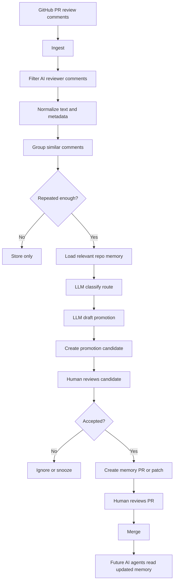
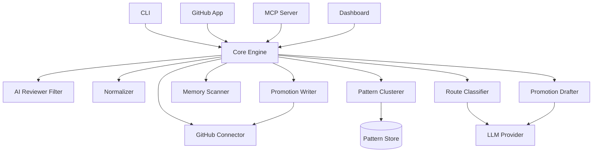

# PRD: Review Memory Router

> 반복되는 AI review comment를 사라지는 PR noise가 아니라, repo가 다음 작업에서 다시 읽을 수 있는 durable memory 후보로 승격시키는 도구.

- **Working title**: Review Memory Router
- **Alternative names**: Promote, Memory Router, Review-to-Memory, Comment Router, Repo Memory Router
- **Document type**: Product Requirements Document
- **Status**: Draft v0.1
- **Date**: 2026-05-19
- **Primary author**: Hayden
- **Primary mode**: OSS-first, product-expandable
- **Interface decision**: undecided. CLI / GitHub App / MCP / hosted dashboard are treated as delivery surfaces over the same core engine.

---

## 1. Executive summary

AI coding tools increasingly write code, review code, and leave PR feedback. Some AI review comments are one-off issues. Others are repeated signals that the repository lacks durable knowledge: a convention not written down, an architectural decision not recorded, a path-specific rule not scoped, or an invariant that should be enforced by tests.

**Review Memory Router** detects repeated AI review comments across PRs, groups similar comments into patterns, classifies where the knowledge should live, drafts a small promotion proposal, and lets a human decide whether to promote it into repository memory.

The product is intentionally conservative.

It should not be another noisy review bot. It should not auto-edit `AGENTS.md`. It should not treat every review comment as memory. It should quietly collect evidence, identify recurring patterns, and produce small, reviewable memory changes.

The ideal user feeling:

> “우리 팀이 매번 반복해서 말하던 암묵지가 일주일에 한 번 정리되어 책상 위에 올라온다.”

---

## 2. Background and thesis

### 2.1 Source thesis

The product comes from the article idea:

> AI review comments are not always just defects in the current PR. Sometimes they reveal implicit knowledge that has not yet been written into the repository.

The article argues that repeated AI review comments should not simply be resolved and forgotten. If the same comment appears again in future PRs, it may need to be promoted into a durable form such as:

- `AGENTS.md` / `CLAUDE.md` / Copilot instructions
- path-scoped rule
- ADR
- test
- lint / type rule
- or deliberately nowhere

The key product insight:

> In the AI coding era, the human reviewer’s new job is not only to judge the diff, but to decide where repeated knowledge should live.

### 2.2 External context

The timing is favorable because AI coding tools are converging around persistent project instructions and agent memory, but the ecosystem is fragmented.

Relevant external signals:

1. **GitHub Copilot supports repository-wide and path-specific custom instructions.** Repository-wide instructions live in `.github/copilot-instructions.md`, while path-specific instructions live under `.github/instructions/*.instructions.md`.
2. **GitHub Copilot coding agent now also supports `AGENTS.md`**, including nested `AGENTS.md` files, while continuing to support `.github/copilot-instructions.md`, `.github/instructions/**.instructions.md`, `CLAUDE.md`, and `GEMINI.md`.
3. **OpenAI Codex supports hierarchical `AGENTS.md` discovery**, walking from project root toward the working directory and concatenating guidance in scope order.
4. **Claude Code uses `CLAUDE.md` and auto memory**, and its own docs recommend adding to `CLAUDE.md` when code review catches something Claude should have known about the codebase. The docs also warn that instructions are context, not enforced configuration, and recommend keeping them specific and concise.
5. **MCP standardizes tools/context for AI applications**, and MCP sampling can let servers request completions through the client’s model, which matters for token ownership and BYOK design.
6. **Developer AI-tool usage is high but trust is not automatic.** The 2025 Stack Overflow Developer Survey reports that 84% of respondents use or plan to use AI tools in development, and 51% of professional developers use them daily.
7. **DORA’s 2025 AI-assisted software development report frames AI as an amplifier of organizational systems.** This supports the product premise that better repository memory and review workflows matter more than simply adding more AI tools.
8. **Developer cognitive load increases with AI automation.** The companion article argues that as AI handles more review and implementation, developers develop "まあいっか" (good enough) psychology — reduced critical scrutiny because "AI checked it." This creates a structural gap: more decisions are made implicitly in AI-generated code, but fewer are consciously captured. The review comment becomes the last visible trace of an implicit decision before it disappears into a merged PR.
9. **Implicit decisions are being lost at scale.** As AI-generated code volume grows, the number of review comments that contain implicit knowledge also grows. But human attention does not scale. The result is a growing pool of discarded decisions — knowledge that was surfaced once in a review comment and never captured durably.

References are listed at the end of this document.

---

## 3. Product position

### 3.1 One-liner

**Review Memory Router picks up decisions being lost in AI review comments and promotes them into durable repository memory: instructions, ADRs, path-scoped rules, tests, or nowhere.**

### 3.2 Product category

This is not primarily an AI code reviewer.

It is a **repository memory lifecycle tool**.

Adjacent categories:

- AI code review tools
- developer productivity tools
- AI coding agent infrastructure
- repository documentation automation
- engineering knowledge management
- platform engineering / DevEx tooling

### 3.3 What makes it different

Most AI review products operate on the current PR:

```text
PR diff -> review comments -> developer fixes -> resolve
```

Review Memory Router operates across PR history:

```text
AI review comments -> repeated patterns -> human routing decision -> memory PR -> future agents behave better
```

The product does not compete by generating more comments. It competes by reducing repeated comments over time.

---

## 4. Problem statement

### 4.1 Current workflow

AI review tools leave comments on PRs. Developers fix or dismiss them. Once the PR is merged, most review knowledge disappears into a closed PR thread.

If the same issue appears again next week, the team pays the same review cost again.

### 4.2 Core pain

Teams lack a workflow for deciding whether repeated AI review comments should become durable repository knowledge.

This creates several problems:

1. **Discarded decisions**  
   AI review comments often contain implicit decisions — why one approach is preferred over another, which utility to use, what invariant must hold. Developers resolve the comment and move on. The decision is never captured. As AI handles more implementation, the volume of these lost decisions grows while human attention to capture them does not.

2. **Repeated corrections**  
   The same AI-generated mistake is corrected again and again.

3. **Memory file pollution**  
   Teams may dump too many rules into `AGENTS.md`, `CLAUDE.md`, or Copilot instructions without routing them by scope or enforceability.

4. **Lost architectural reasoning**  
   Some comments are not conventions but decisions. They need ADRs, not instruction snippets.

5. **Weak enforcement**  
   Some comments represent invariants that should become tests, lint rules, or type constraints.

6. **No evidence trail**  
   When someone proposes a new rule, maintainers lack evidence showing where the pattern came from.

7. **Tool fragmentation**  
   Different agent tools read different memory files. Teams need routing logic that is not locked to a single AI vendor.

### 4.3 Why now

The ecosystem has recently made repository memory more valuable:

- AI coding agents increasingly read repository instructions before working.
- Multiple tools support instruction files, but the file formats and scoping rules differ.
- Teams are accumulating more AI review comments, but do not yet have a mature lifecycle for them.
- As AI-generated code volume increases, human review attention becomes more expensive and should focus on durable decisions rather than repeated local fixes.

---

## 5. Goals and non-goals

### 5.1 Goals

1. Detect repeated AI review comment patterns across PRs.
2. Classify whether a pattern should be promoted, ignored, snoozed, or converted into another enforcement mechanism.
3. Suggest the correct destination for durable knowledge.
4. Draft small, atomic memory changes.
5. Preserve human control over all memory changes.
6. Keep memory files concise and scoped.
7. Support multiple AI coding ecosystems instead of locking into one memory file format.
8. Work as OSS for individual developers and maintainers.
9. Be productizable for teams that want hosted automation and GitHub App integration.
10. Reduce token consumption in AI implementation and review cycles by ensuring agents read promoted rules upfront instead of generating incorrect code that triggers repeated review corrections.

### 5.2 Non-goals for MVP

1. Do not replace AI code review tools.
2. Do not generate new code review comments on every PR.
3. Do not auto-merge memory changes.
4. Do not auto-edit `AGENTS.md`, `CLAUDE.md`, or instruction files without human review.
5. Do not build a heavy dashboard in v0.
6. Do not solve organization-wide knowledge management in v0.
7. Do not support every VCS platform in v0. GitHub first.
8. Do not support every code host or every review bot in v0.
9. Do not require a specific LLM provider in the core architecture.

---

## 6. Target users and personas

### 6.1 Persona A: OSS maintainer using AI review tools

- Maintains one or more repositories.
- Uses Copilot, CodeRabbit, Claude Code, Greptile, or similar tools.
- Wants to reduce repeated review noise.
- Is comfortable using CLI and BYOK.
- Values transparency and small PRs.

Primary need:

> “반복되는 AI 리뷰 지적을 모아서, repo rule로 남길지 판단하고 싶다.”

### 6.2 Persona B: AI-native frontend/fullstack engineer

- Uses AI agents daily for implementation.
- Writes `AGENTS.md`, `CLAUDE.md`, or Copilot instructions.
- Cares about review quality and repository conventions.
- Wants a portfolio-worthy OSS tool.

Primary need:

> “내가 AI coding workflow를 얼마나 깊게 이해하는지 보여주는 실전 도구가 필요하다.”

### 6.3 Persona C: Team lead / reviewer

- Reviews many PRs per week.
- Sees repeated comments about conventions, architecture, tests, security, or style.
- Wants to turn repeated feedback into durable team standards.
- Does not want another noisy bot.

Primary need:

> “PR마다 같은 말을 하지 않게, 반복되는 review knowledge를 정리하고 싶다.”

### 6.4 Persona D: Platform / DevEx engineer

- Owns developer productivity and engineering systems.
- Wants measurable reduction in review rework.
- Cares about GitHub App permissions, audit logs, privacy, and rollout control.

Primary need:

> “팀 전체의 AI-assisted development workflow를 더 안전하고 재사용 가능하게 만들고 싶다.”

### 6.5 Persona E: Enterprise buyer, later

- Needs policy, permission, retention, self-hosting, and metrics.
- Buys tools that improve code review throughput, quality, and AI governance.

Primary need:

> “AI가 만든 코드와 리뷰의 학습 루프를 governance 가능한 방식으로 관리하고 싶다.”

---

## 7. Jobs to be done

### JTBD-001: Find repeated AI review patterns

When I receive many AI review comments across PRs, I want to know which comments are recurring patterns, so that I can stop treating them as isolated PR issues.

### JTBD-002: Decide where knowledge should live

When a repeated pattern appears, I want the tool to suggest whether it belongs in instructions, ADR, tests, lint, or nowhere, so that repository memory stays useful instead of noisy.

### JTBD-003: Create small memory PRs

When I accept a promotion candidate, I want the tool to create a small PR with evidence and a proposed diff, so that humans can review and merge it safely.

### JTBD-004: Avoid memory pollution

When the tool sees low-confidence or one-off comments, I want it to stay silent, so that `AGENTS.md` and similar files do not become a junk drawer.

### JTBD-005: Work across tools

When my team uses different AI coding tools, I want the tool to understand multiple memory destinations, so that I do not lock my workflow to one vendor.

---

## 8. Product principles

1. **Quiet by default**  
   The tool should be silent unless there is repeated evidence.

2. **Human decides**  
   The tool can draft, but humans route and merge.

3. **Evidence first**  
   Every promotion candidate must show the PR comments that caused it.

4. **Small PRs**  
   One promoted pattern should produce one atomic memory PR.

5. **Conservative classification**  
   If unsure, choose `pr_only`, `none`, or ask for human routing.

6. **Memory-file agnostic**  
   The product should support `AGENTS.md`, `CLAUDE.md`, Copilot instructions, path-scoped rules, ADRs, tests, lint rules, and future formats.

7. **Do not confuse memory with enforcement**  
   Some knowledge should become tests or lint rules, not instructions.

8. **Interfaces are replaceable**  
   CLI, GitHub App, and MCP are surfaces. The core engine is the product.

9. **Trust through transparency**  
   Expose classification reasons, confidence, examples, and alternatives.

10. **Multilingual by design**  
    The tool should handle Japanese, Korean, English, and mixed code/review text.

---

## 9. Core concept: routing taxonomy

The product routes each repeated pattern into one of the following targets.

| Target | Meaning | Example | Output |
|---|---|---|---|
| `none` | Not worth preserving | One-off nit, vague comment | No action |
| `pr_only` | Relevant only to current PR | Ambiguous variable name in this diff | No durable memory |
| `agents` | Repo-wide AI instruction | Use shared API client instead of direct fetch | `AGENTS.md`, `CLAUDE.md`, `.github/copilot-instructions.md` |
| `path_scoped_rule` | Rule applies to a path/domain | In `payment/**`, use minor units | `.github/instructions/payment.instructions.md`, nested `AGENTS.md`, `.claude/rules` |
| `adr` | Decision rationale matters | Why search filters live in URL state | `docs/adr/NNN-title.md` |
| `test` | Runtime/user-visible invariant | Non-admin cannot see delete button | Test stub or test PR |
| `lint_or_type` | Mechanically enforceable invariant | No direct import from internal package path | ESLint rule, type wrapper, static check |
| `docs` | Human-facing documentation | Setup step repeatedly misunderstood | README/docs update |

MVP may start with five destinations:

```text
none
agents
path_scoped_rule
adr
test
```

`lint_or_type` and `docs` can be added after the core loop is validated.

---

## 10. End-to-end workflow

### 10.1 Interface-neutral core flow



### 10.2 Key loop

```text
Repeated AI review comment
-> evidence-backed promotion candidate
-> human routing decision
-> small memory PR
-> future AI-assisted work uses the memory
```

### 10.3 Example scenario

1. Claude Code review comments on PR #347:

```text
feature配下では fetch を直接呼ばず、shared/api/client.ts を使ってください。
```

2. Similar comments appear in #352, #360, and #366.
3. The tool clusters them as one pattern.
4. Classifier suggests:

```json
{
  "target": "agents",
  "confidence": 0.91,
  "summary": "Feature code should use the shared API client instead of direct fetch."
}
```

5. Digest shows the candidate with evidence links.
6. Human chooses `/promote agents`.
7. Tool creates a PR:

```text
promote: require shared API client for feature code
```

8. PR modifies `AGENTS.md` or another configured instruction file.
9. Human reviews and merges.

---

## 11. MVP scope

### 11.1 MVP definition

The MVP should prove that the product can:

1. Read historical PR review comments from a GitHub repository.
2. Filter likely AI-generated review comments.
3. Detect repeated patterns.
4. Use LLM only on repeated clusters, not every comment.
5. Suggest a routing target and draft memory text.
6. Output a markdown digest.
7. Generate a patch or branch for a selected promotion candidate.

### 11.2 MVP default interface

Because the final interface is undecided, MVP should be built around a core engine and initially exposed through a CLI.

Recommended MVP interface:

```bash
review-memory-router scan --repo owner/repo --since 60d --out digest.md
```

Then:

```bash
review-memory-router promote candidate_001 --target agents --write
```

Optional:

```bash
review-memory-router promote candidate_001 --target agents --create-pr
```

### 11.3 Why CLI first

CLI first keeps the MVP focused on the hard problem:

```text
cluster -> classify -> draft -> evidence-backed proposal
```

It avoids early complexity:

- GitHub App installation
- webhooks
- queues
- billing
- hosted secrets
- team permissions
- dashboard UX

### 11.4 GitHub App as product MVP

After CLI validation, a hosted GitHub App becomes the product MVP.

Hosted flow:

```text
Install GitHub App
-> app scans recent PR comments
-> app creates weekly digest issue
-> user comments /promote agents
-> app opens memory PR
```

### 11.5 Implementation decisions (from MVP development)

The following decisions were made during implementation:

1. **LLM direct clustering for providers without embeddings.** Anthropic does not offer an embedding API. When the user selects Anthropic as the LLM provider, clustering is performed by sending all comments to the LLM and asking it to group similar ones, instead of using embedding-based pre-clustering. This removes the need for a second API key. Temperature is set to 0 for determinism.

2. **Interactive review flow after scan.** After classification completes, the CLI offers an interactive review mode where the user can approve, skip, or change the target for each candidate one by one. This replaces the original digest-only output model with an optional in-CLI decision workflow.

3. **Parallel classification with ordered output.** Classification runs with concurrency 3 to reduce total wall time, but results are buffered and printed in the original cluster order. This gives the user a consistent, readable output while benefiting from parallelism.

4. **Auto-detect repository from git remote.** When `--repo` is omitted, the CLI reads the current directory's `git remote get-url origin` and extracts the `owner/repo` format. This enables `promote scan` with zero arguments.

5. **Remote repo guard.** If the scanned repository does not match the current directory's git remote, the CLI warns the user that promoting will write files to the current directory, which may cause unintended pollution. The user can choose to proceed or keep the digest only.

6. **Multi-tool instruction file support.** The `promote init` command offers tool-specific presets for Claude Code, OpenAI Codex, GitHub Copilot, Cursor, Windsurf, and Gemini CLI, each with correct root instruction file and path-scoped rule directory defaults.

### 11.6 MCP as power-user interface

MCP should not be the first interface, but the architecture should not block it.

MCP flow:

```text
Claude Code / AI client
-> call tool: analyze_review_memory
-> inspect candidates
-> call tool: create_memory_promotion_pr
```

---

## 12. Functional requirements

### FR-001: Repository configuration

The system must support a repository-level config file.

Suggested file:

```yaml
# .review-memory-router.yml
version: 1

aiReviewers:
  - github-copilot[bot]
  - coderabbitai[bot]
  - greptile-apps[bot]
  - claude[bot]

memoryTargets:
  agents:
    preferredFiles:
      - AGENTS.md
      - CLAUDE.md
      - .github/copilot-instructions.md
  pathScoped:
    preferredDir: .github/instructions
  adr:
    dir: docs/adr
    template: docs/adr/TEMPLATE.md
  tests:
    mode: stub-only

thresholds:
  minOccurrences: 3
  windowDays: 60
  minConfidence: 0.75

output:
  digestMode: markdown
  createPr: false
```

### FR-002: Historical PR review comment ingestion

The system must fetch PR review comments for a repository.

Minimum fields:

```ts
type RawReviewComment = {
  id: string
  repo: string
  prNumber: number
  authorLogin: string
  authorType: "Bot" | "User" | "Unknown"
  body: string
  bodyText?: string
  path?: string
  line?: number
  diffHunk?: string
  htmlUrl: string
  createdAt: string
  updatedAt?: string
}
```

### FR-003: Webhook ingestion, product version

For hosted GitHub App mode, the system must listen to:

- `pull_request_review_comment`
- `pull_request_review`
- `issue_comment`, for slash commands
- optional `pull_request`, for PR metadata

### FR-004: AI reviewer filtering

The system must identify AI review comments using:

1. configured author allowlist
2. GitHub `Bot` account type
3. known bot name patterns
4. optional body heuristics

The filter should be configurable because bot account names vary.

### FR-005: Noise filtering

The system should ignore low-information comments such as:

- `LGTM`
- `nit:` with no reusable content
- simple typo-only comments
- duplicate bot disclaimers
- generated summaries that are not review comments
- comments below minimum character threshold

### FR-006: Comment normalization

The system must normalize comment text before clustering.

Normalization includes:

- strip markdown boilerplate
- remove quoted code blocks when too large
- preserve identifiers and paths
- detect language hint: `en`, `ja`, `ko`, `mixed`, `unknown`
- extract mentioned symbols, files, libraries, commands, rules
- normalize whitespace

### FR-007: Embedding / fingerprint generation

The system should generate a similarity representation per comment.

MVP options:

1. Embeddings through configured LLM provider
2. Local embeddings, if available
3. Heuristic fingerprint fallback

Fingerprint components:

```text
normalized body
+ mentioned identifiers
+ path segments
+ author
+ extracted action verb
```

### FR-008: Clustering repeated comments

The system must group similar comments into clusters.

Default thresholds:

```yaml
minOccurrences: 3
windowDays: 60
similarityThreshold: 0.82
```

Clustering should consider:

- semantic similarity
- path similarity
- identifier overlap
- repeated phrasing
- reviewer source

### FR-009: Existing memory scan

Before drafting a candidate, the system should scan relevant memory files to avoid duplicate suggestions.

Files to detect:

```text
AGENTS.md
AGENTS.override.md
CLAUDE.md
CLAUDE.local.md
.github/copilot-instructions.md
.github/instructions/*.instructions.md
.claude/rules/*
docs/adr/*.md
README.md
```

MVP can scan:

```text
AGENTS.md
CLAUDE.md
.github/copilot-instructions.md
.github/instructions/*.instructions.md
docs/adr/*.md
```

The scan should not blindly send full files to the LLM. It should extract headings, relevant snippets, and matching sections.

### FR-010: Routing classification

The system must classify each repeated cluster into a routing target.

Output schema:

```ts
type RoutingDecision = {
  target:
    | "none"
    | "pr_only"
    | "agents"
    | "path_scoped_rule"
    | "adr"
    | "test"
    | "lint_or_type"
    | "docs"
  confidence: number
  summary: string
  reason: string
  suggestedFile?: string
  pathScope?: string
  alternatives: Array<{
    target: string
    reason: string
  }>
  needsHumanDecision: boolean
}
```

### FR-011: Conservative behavior

If confidence is below the configured threshold, the system must not propose a memory PR by default.

Low-confidence output should be either:

```text
none
pr_only
needs_human_decision
```

### FR-012: Draft generation

For accepted candidates, the system must generate a draft patch appropriate to the target.

Examples:

#### `agents`

```md
## API access

- Feature code must not call `fetch` directly.
- Use `src/shared/api/client.ts` for API requests.
- If new API behavior is needed, extend the shared client instead of bypassing it.
```

#### `path_scoped_rule`

```md
---
applyTo: "src/features/payment/**/*.ts,src/features/payment/**/*.tsx"
---

# Payment rules

- Store and calculate money amounts in minor units.
- Do not use floating-point `number` values for money calculations.
- Use `src/shared/money` utilities for conversions.
```

#### `adr`

```md
# ADR-007: Store search filters in URL state

## Status

Proposed

## Context

Search filters need to survive reloads, browser navigation, and URL sharing.

## Decision

Use URLSearchParams as the source of truth for search filters.

## Consequences

- Search state can be shared via URL.
- Components read filter state from the URL.
- Introducing local-only search state requires a new decision record.
```

#### `test`

```ts
it("does not show admin actions to non-admin users", () => {
  render(<UserActions role="member" />)

  expect(
    screen.queryByRole("button", { name: "Delete user" })
  ).not.toBeInTheDocument()
})
```

### FR-013: Markdown digest generation

The system must generate a digest of promotion candidates.

Digest must include:

- candidate ID
- summary
- suggested target
- confidence
- occurrences count
- evidence links
- affected paths
- suggested patch
- alternatives considered
- commands / actions

Example:

```md
# Memory Promotion Candidates

## 1. Use shared API client instead of direct fetch

- Candidate ID: `candidate_001`
- Suggested target: `AGENTS.md`
- Confidence: 0.91
- Occurrences: 5 PR comments over 60 days

### Evidence

- #347 `src/features/quest/api.ts`
- #352 `src/features/gacha/api.ts`
- #360 `src/features/shop/api.ts`

### Suggested rule

```md
## API access

- Feature code must not call `fetch` directly.
- Use `src/shared/api/client.ts` for API requests.
```

### Actions

```bash
review-memory-router promote candidate_001 --target agents --write
review-memory-router ignore candidate_001
review-memory-router snooze candidate_001 --days 30
```
```

### FR-014: Promotion action handling

The system must support actions:

```text
promote
ignore
snooze
change-target
regenerate
explain
```

CLI examples:

```bash
review-memory-router promote candidate_001 --target agents --write
review-memory-router promote candidate_002 --target adr --create-pr
review-memory-router ignore candidate_003 --reason "too specific"
review-memory-router snooze candidate_004 --days 30
```

GitHub App slash command examples:

```text
/promote candidate_001 agents
/promote candidate_002 adr
/ignore candidate_003
/snooze candidate_004 30d
```

MCP tool examples:

```text
analyze_review_memory
create_memory_promotion_pr
ignore_review_memory_candidate
```

### FR-015: Memory PR creation

When creating a PR, the system must:

- create a new branch
- apply a minimal patch
- create a PR with evidence
- apply label `memory-promotion`
- request CODEOWNERS if possible
- never merge automatically

PR title format:

```text
promote: require shared API client for feature code
```

PR body format:

```md
## Why this promotion was suggested

Similar AI review comments appeared in 5 PRs over the last 60 days.

## Evidence

- #347 `src/features/quest/api.ts`
- #352 `src/features/gacha/api.ts`
- #360 `src/features/shop/api.ts`

## Suggested destination

`AGENTS.md`

## Reasoning

This is a repeated cross-feature implementation convention. It is not a one-off PR issue and does not require an ADR because the main need is future agent behavior guidance.

## Alternatives considered

- `path_scoped_rule`: rejected because examples appear across multiple feature directories.
- `test`: rejected because this is a coding convention rather than a runtime invariant.

## Safety

This PR was generated as a draft. It requires human review and merge.
```

### FR-016: Duplicate suppression

If a pattern has already been promoted or ignored, the system should not repeatedly suggest it.

State values:

```text
candidate
promoted
ignored
snoozed
closed_duplicate
needs_human_decision
```

### FR-017: Audit trail

The system must preserve a trail from memory change back to source comments.

For every promotion:

```text
memory PR -> candidate -> cluster -> source comments -> original PR links
```

### FR-018: Multilingual support

The system should support mixed Japanese, Korean, and English review comments.

Requirements:

- cluster semantically similar comments across languages
- preserve original evidence language
- generate draft in repository-preferred language
- config option:

```yaml
language:
  preferredOutput: ja
  fallback: en
```

### FR-019: Cost controls

The system must avoid LLM calls on every comment.

Rules:

- use LLM only after clustering identifies repeated patterns
- cap examples per cluster
- cap memory snippets
- cache classification by cluster fingerprint
- support cheaper model for classification and stronger model for drafting

### FR-020: BYOK support

OSS/CLI mode should support BYOK.

Supported environment variables:

```bash
OPENAI_API_KEY=
ANTHROPIC_API_KEY=
GOOGLE_API_KEY=
REVIEW_MEMORY_ROUTER_API_KEY=
```

Provider-agnostic abstraction:

```ts
type LLMProvider = {
  embed(texts: string[]): Promise<number[][]>
  generateObject<T>(input: GenerateObjectInput<T>): Promise<T>
}
```

---

## 13. Non-functional requirements

### NFR-001: Privacy

The tool should store the minimum necessary data.

Default stored data:

- review comment text
- PR number
- path
- URL
- author login
- timestamps
- cluster metadata

Avoid storing full source code by default.

### NFR-002: Permissions

GitHub App should request minimum permissions.

Likely permissions:

- Pull requests: read for ingestion, write for comments/PRs if enabled
- Contents: read for memory scan, write for branch patch if PR creation is enabled
- Issues: write for digest issue and slash commands
- Metadata: read

### NFR-003: Security

- Verify GitHub webhook signatures.
- Do not execute repository code.
- Redact secrets in comments and diffs before LLM calls.
- Allow self-hosting for private repositories.
- Support data deletion by repository.

### NFR-004: Performance

CLI mode:

- A 60-day scan on a small-to-medium repo should complete within a few minutes.
- Historical import can be incremental.

Hosted mode:

- Webhook processing should enqueue jobs quickly.
- Digest generation can be asynchronous.

### NFR-005: Reliability

- Failed LLM calls should not lose ingested data.
- Webhook retries must be idempotent.
- Candidate generation must be deterministic enough for repeated runs.

### NFR-006: Explainability

Every routing decision must include:

- target
- confidence
- reason
- evidence
- alternatives

### NFR-007: Extensibility

The core engine should not assume one interface.

Interfaces:

- CLI
- GitHub App
- MCP server
- dashboard
- GitHub Action

### NFR-008: Model portability

The system should allow multiple LLM providers.

MVP can support one provider, but the architecture should isolate:

- embeddings
- structured generation
- prompt templates
- cost tracking

---

## 14. Architecture

### 14.1 Interface-neutral architecture



### 14.2 Package structure

```text
packages/
  core/
    src/
      ingest/
      normalize/
      filter/
      cluster/
      memory-scan/
      classify/
      draft/
      promote/
      config/
      eval/

  cli/
    src/index.ts

  github-app/
    src/webhook.ts
    src/jobs.ts
    src/commands.ts
    src/pr.ts

  mcp-server/
    src/tools.ts
    src/server.ts

  shared/
    src/types.ts
    src/schemas.ts
```

### 14.3 Core function

```ts
type AnalyzeReviewMemoryInput = {
  repo: RepoRef
  sinceDays: number
  config: ReviewMemoryRouterConfig
  mode: "dry-run" | "digest" | "pr"
}

type AnalyzeReviewMemoryOutput = {
  candidates: PromotionCandidate[]
  stats: AnalysisStats
}

async function analyzeReviewMemory(
  input: AnalyzeReviewMemoryInput
): Promise<AnalyzeReviewMemoryOutput> {
  const comments = await ingestReviewComments(input.repo, input.sinceDays)
  const aiComments = filterAIReviewComments(comments, input.config.aiReviewers)
  const normalized = normalizeComments(aiComments)
  const clusters = await clusterSimilarComments(normalized, input.config.thresholds)
  const repeated = clusters.filter(c => c.occurrences.length >= input.config.thresholds.minOccurrences)

  const candidates = []

  for (const cluster of repeated) {
    const memory = await loadRelevantMemory(input.repo, cluster, input.config.memoryTargets)
    const decision = await classifyRoute(cluster, memory, input.config)

    if (decision.confidence < input.config.thresholds.minConfidence) {
      continue
    }

    if (decision.target === "none" || decision.target === "pr_only") {
      continue
    }

    const draft = await draftPromotion(cluster, decision, memory, input.config)

    candidates.push({
      id: createCandidateId(cluster),
      cluster,
      decision,
      draft,
    })
  }

  return {
    candidates,
    stats: buildStats(comments, aiComments, clusters, candidates),
  }
}
```

---

## 15. Data model

### 15.1 SQLite for CLI

CLI should start with local SQLite for simplicity.

```text
.review-memory-router/
  db.sqlite
  cache/
  digests/
```

### 15.2 Postgres for hosted mode

Hosted mode should use Postgres, with pgvector if embeddings are stored.

```sql
create table repositories (
  id text primary key,
  owner text not null,
  name text not null,
  installation_id text,
  default_branch text,
  created_at timestamptz not null default now()
);

create table review_comments (
  id text primary key,
  repository_id text not null references repositories(id),
  pr_number int not null,
  author_login text not null,
  author_type text,
  body text not null,
  body_text text,
  path text,
  line int,
  diff_hunk text,
  html_url text not null,
  created_at timestamptz not null,
  embedding vector
);

create table comment_clusters (
  id uuid primary key,
  repository_id text not null references repositories(id),
  fingerprint text not null,
  summary text,
  occurrence_count int not null,
  status text not null default 'candidate',
  created_at timestamptz not null default now(),
  updated_at timestamptz not null default now()
);

create table cluster_examples (
  cluster_id uuid references comment_clusters(id),
  comment_id text references review_comments(id),
  primary key (cluster_id, comment_id)
);

create table promotion_candidates (
  id uuid primary key,
  repository_id text not null references repositories(id),
  cluster_id uuid not null references comment_clusters(id),
  target text not null,
  confidence numeric not null,
  summary text not null,
  reason text not null,
  suggested_file text,
  suggested_patch text,
  alternatives jsonb,
  status text not null default 'candidate',
  created_at timestamptz not null default now()
);

create table promotions (
  id uuid primary key,
  candidate_id uuid not null references promotion_candidates(id),
  pr_number int,
  branch_name text,
  status text not null,
  created_at timestamptz not null default now(),
  merged_at timestamptz
);

create table ignored_patterns (
  id uuid primary key,
  repository_id text not null references repositories(id),
  fingerprint text not null,
  reason text,
  snoozed_until timestamptz,
  created_at timestamptz not null default now()
);
```

---

## 16. LLM usage design

### 16.1 What uses AI

AI should be used for:

1. Semantic classification of repeated clusters.
2. Drafting concise memory snippets.
3. Explaining alternatives.
4. Optional cross-language summarization.

### 16.2 What should not use AI

AI should not be used for:

1. Fetching comments.
2. Basic bot filtering.
3. Basic config parsing.
4. GitHub API operations.
5. Deterministic duplicate suppression.
6. Permission decisions.

### 16.3 LLM call policy

Bad:

```text
Call LLM once per comment.
```

Good:

```text
Ingest all comments.
Cluster first.
Call LLM only for repeated clusters.
```

### 16.4 Clustering approach: A+B hybrid

The product uses a two-step clustering approach:

**Step A: Algorithmic pre-clustering (cheap)**
- Generate embeddings for normalized comments
- Compute weighted similarity: 0.6 semantic + 0.25 identifier overlap + 0.15 path overlap
- Greedy single-linkage clustering with threshold (default 0.82)
- AI review comments are structurally easier to cluster than general text: they reference specific paths/identifiers and use action-oriented language

**Step B: LLM refinement (accurate)**
- Only clusters with >= minOccurrences members reach the LLM
- LLM validates cluster coherence, may merge or split
- LLM classifies routing target with structured output
- One LLM call per repeated cluster (typically 5-20 clusters per scan)

This hybrid minimizes LLM token consumption while maintaining classification accuracy. For MVP, Step A reduces LLM input from hundreds of raw comments to tens of cluster summaries.

### 16.5 Classification prompt sketch

```text
Ingest all comments.
Cluster first.
Call LLM only for repeated clusters.
```

### 16.4 Classification prompt sketch

```text
You are routing repeated AI code review comments into durable repository memory.

Do not fix the code.
Do not preserve every comment.
Be conservative.

A comment should be promoted only if it represents knowledge that future humans or AI agents should reuse.

Available targets:
- none
- pr_only
- agents
- path_scoped_rule
- adr
- test
- lint_or_type
- docs

Rules:
- If the comment only matters for the current diff, choose pr_only.
- If it is a repeated repo-wide coding convention, choose agents.
- If it only applies to specific paths or domains, choose path_scoped_rule.
- If the reason for a decision matters, choose adr.
- If it is an invariant that can be enforced, choose test or lint_or_type.
- If unsure, choose none or pr_only.

Return JSON only.
```

### 16.5 Output schema

```json
{
  "target": "agents",
  "confidence": 0.91,
  "summary": "Feature code should use the shared API client instead of direct fetch.",
  "reason": "The comments describe a repeated cross-feature implementation convention, not a one-off PR issue.",
  "suggested_file": "AGENTS.md",
  "path_scope": null,
  "suggested_patch": "## API access\n\n- Feature code must not call `fetch` directly.\n- Use `src/shared/api/client.ts` for API requests.\n",
  "alternatives": [
    {
      "target": "path_scoped_rule",
      "reason": "Less suitable because examples appear across multiple feature directories."
    },
    {
      "target": "test",
      "reason": "Less suitable because this is a coding convention, not a runtime invariant."
    }
  ],
  "needs_human_decision": true
}
```

### 16.6 Token ownership by interface

| Interface | Who pays LLM cost? | User experience | Best use |
|---|---|---|---|
| CLI BYOK | User’s provider key | More setup, OSS-friendly | v0 dogfood, public OSS |
| CLI + hosted API | Product backend | Smooth CLI, account needed | Pro users |
| Hosted GitHub App | Product backend | Best team UX | Commercial MVP |
| Local MCP + host model | MCP client / user’s AI app | No server key needed if sampling supported | Power users |
| MCP + hosted API | Product backend | Controlled SaaS behavior | Later product expansion |

### 16.7 Recommended token strategy

1. **v0 OSS**: CLI BYOK.
2. **v1 product**: hosted GitHub App pays LLM cost, with free quota and paid tiers.
3. **v1.5 MCP**: support both local BYOK and MCP sampling where client supports it.
4. **Enterprise**: self-hosted mode with customer-controlled model provider.

---

## 17. Interface options

The interface is not final. The product should be designed so that all interfaces share the same core engine.

### 17.1 Option A: CLI

#### Flow

```bash
review-memory-router init
review-memory-router scan --repo owner/repo --since 60d --out digest.md
review-memory-router promote candidate_001 --target agents --write
```

#### Pros

- Fastest to build.
- OSS-friendly.
- Easy to dogfood.
- Avoids hosted cost early.
- Good for technically sophisticated early adopters.

#### Cons

- BYOK setup friction.
- Harder for teams to adopt casually.
- No automatic weekly digest unless used with cron/GitHub Actions.
- Less magical than GitHub App.

#### Token model

- User’s provider key by default.
- Optional hosted API later.

#### Recommended role

Start here.

### 17.2 Option B: GitHub App

#### Flow

```text
Install app
-> scan recent PR review comments
-> weekly digest issue
-> user comments /promote candidate_001 agents
-> app opens memory PR
```

#### Pros

- Best product UX.
- No local setup.
- Works where PR comments already live.
- Enables recurring digest.
- Enables commercial pricing.

#### Cons

- Requires backend, queue, auth, webhooks, permissions.
- LLM costs move to product owner.
- Private repo trust barrier.
- More security and reliability work.

#### Token model

- Product backend pays by default.
- Could allow customer-provided keys for enterprise.

#### Recommended role

Product MVP after CLI validates the core engine.

### 17.3 Option C: MCP server

#### Flow

```text
User in Claude Code / agent client:
"Analyze repeated AI review comments and suggest memory promotions."

MCP tool calls:
- analyze_review_memory
- get_promotion_candidate
- create_memory_promotion_pr
```

#### Pros

- AI-native workflow.
- Strong positioning with agent users.
- Lets the user ask natural-language questions about review memory.
- Can use host model via sampling in clients that support it.

#### Cons

- MCP client support varies.
- Harder to explain to mainstream teams.
- Not ideal as first product surface.
- UX depends on host app.

#### Token model

Three modes:

1. MCP server returns data only, host model reasons.
2. MCP server requests sampling from client, where supported.
3. MCP server calls hosted backend.

#### Recommended role

Power-user wedge after CLI/GitHub App core works.

### 17.4 Option D: Dashboard

#### Flow

```text
Open dashboard
-> see patterns, health, trends
-> approve promotions
-> review memory file health
```

#### Pros

- Good for teams and managers.
- Supports analytics and billing.
- Easier onboarding for non-CLI users.

#### Cons

- Expensive to build.
- Not needed to prove core value.
- Can become a beautiful empty palace.

#### Recommended role

Later.

### 17.5 Option E: GitHub Action

#### Flow

```yaml
name: Review Memory Digest
on:
  schedule:
    - cron: "0 0 * * 1"

jobs:
  digest:
    uses: review-memory-router/action@v1
```

#### Pros

- OSS-friendly.
- No hosted backend required.
- Easy for public repos.

#### Cons

- Secrets management still needed.
- Less interactive.
- PR creation and issue commands are more awkward.

#### Recommended role

Good bridge between CLI and GitHub App.

---

## 18. UX details

### 18.1 Digest-first UX

Default mode should be digest-first, not inline PR comments.

Reason:

- Inline suggestions add noise to already noisy PRs.
- The product is about repeated patterns, not immediate fixes.
- Weekly digest encourages calm routing decisions.

### 18.2 Digest example

```md
# 🧠 Memory Promotion Digest — Week of 2026-05-18

This digest contains repeated AI review comment patterns that may deserve durable repository memory.

## Candidate 1: Use shared API client instead of direct fetch

- Suggested target: `AGENTS.md`
- Confidence: 0.91
- Occurrences: 5 PR comments over 60 days
- Affected paths: `src/features/**/api.ts`

### Evidence

- #347 `src/features/quest/api.ts`
- #352 `src/features/gacha/api.ts`
- #360 `src/features/shop/api.ts`
- #366 `src/features/profile/api.ts`
- #371 `src/features/campaign/api.ts`

### Suggested patch

```md
## API access

- Feature code must not call `fetch` directly.
- Use `src/shared/api/client.ts` for API requests.
- If new API behavior is needed, extend the shared client instead of bypassing it.
```

### Why this target

This appears to be a repeated cross-feature implementation convention. It should guide future AI-generated changes. It is not specific enough to require an ADR and is not directly enforceable as a runtime test.

### Actions

```text
/promote candidate_001 agents
/promote candidate_001 path .github/instructions/frontend.instructions.md
/promote candidate_001 adr
/promote candidate_001 test
/ignore candidate_001
/snooze candidate_001 30d
```
```

### 18.3 Memory PR UX

Memory PR must be small.

Principles:

- One pattern per PR.
- Evidence in PR description.
- Draft diff is concise.
- Human review required.
- CODEOWNERS should apply naturally.

### 18.4 Inline PR suggestion mode

Optional, disabled by default.

Inline comment example:

```md
💡 This AI review comment looks like a repeated pattern.

Similar comments appeared in 4 PRs over the last 30 days.

Suggested destination: `AGENTS.md`
Confidence: 0.87

Actions:
- `/promote agents`
- `/promote path src/features/payment/**`
- `/promote adr`
- `/promote test`
- `/ignore`
```

This mode should be opt-in because it can create noise.

---

## 19. Metrics

### 19.1 Activation metrics

- Repos installed / initialized
- Successful first scan
- Number of comments ingested
- Number of clusters found
- Number of candidates generated
- User viewed digest
- User promoted first candidate

### 19.2 Quality metrics

- Promotion acceptance rate
- Candidate ignore rate
- Candidate snooze rate
- Human-changed target rate
- Memory PR merge rate
- Memory PR close-without-merge rate
- Average confidence of merged candidates

### 19.3 Outcome metrics

- Reduction in repeated comments after promotion
- Time from repeated pattern detection to memory PR merge
- Number of repeated AI review comments prevented or marked as already covered
- Memory file growth rate
- Ratio of promoted rules to ignored rules

### 19.4 Safety metrics

- Incorrect routing reports
- Duplicate suggestion rate
- Memory pollution reports
- LLM token cost per repo per month
- Private data redaction failures

---

## 20. Evaluation strategy

### 20.1 Why eval matters

The classifier is the product’s trust core. If it routes incorrectly, it pollutes memory files and violates the product thesis.

### 20.2 Golden dataset

Build a manually labeled dataset of AI review comment clusters.

Each example should include:

```json
{
  "comments": ["...", "...", "..."],
  "paths": ["..."],
  "expectedTarget": "agents",
  "acceptableTargets": ["agents", "path_scoped_rule"],
  "badTargets": ["adr", "test"],
  "reason": "Repeated cross-feature convention."
}
```

### 20.3 Initial dataset size

MVP:

- 50 clusters minimum
- 10 per primary target:
  - `none` / `pr_only`
  - `agents`
  - `path_scoped_rule`
  - `adr`
  - `test`

v1:

- 200+ clusters
- multilingual examples
- real examples from public repos or synthetic examples based on real patterns

### 20.4 Eval metrics

- top-1 target accuracy
- acceptable target accuracy
- over-promotion rate
- under-promotion rate
- target confusion matrix
- patch quality score
- hallucinated file/path rate

### 20.5 Success threshold

MVP acceptable:

```text
acceptable target accuracy >= 80%
over-promotion rate <= 10%
hallucinated file/path rate <= 5%
```

Production target:

```text
acceptable target accuracy >= 90%
over-promotion rate <= 5%
hallucinated file/path rate <= 2%
```

### 20.6 Public eval as OSS asset

The eval dataset and routing rubric should be public when possible.

This becomes part of the OSS moat:

- transparent behavior
- community contributions
- reproducible comparison across models
- useful content for blog posts and talks

---

## 21. OSS strategy

### 21.1 OSS-first positioning

The project should launch as OSS because:

1. The tool needs repository access, so transparency matters.
2. Developers are more likely to try a CLI that they can inspect.
3. BYOK is natural for early adopters.
4. The routing taxonomy benefits from community discussion.
5. The project can become a reference implementation for review-comment-to-memory workflows.

### 21.2 OSS value as “자기 PR”

This project is strong as a personal/career artifact because it demonstrates:

1. **Problem taste**  
   It identifies a new workflow problem created by AI coding, not just a generic wrapper around an LLM.

2. **System design**  
   It involves ingestion, clustering, LLM routing, GitHub automation, evals, and developer UX.

3. **AI-native product thinking**  
   It treats AI as part of a workflow with human routing and durable state, not as magic autocomplete.

4. **Writing-to-product loop**  
   The product is directly derived from a published technical thesis. This creates a coherent narrative: article -> tool -> evaluation -> talk.

5. **OSS credibility**  
   Public repo, real dogfooding, issues, examples, and evals are stronger evidence than a private side project.

6. **Japan/Korea/English bridge**  
   A multilingual AI-dev workflow tool with Japanese Zenn thought leadership is differentiated.

7. **Interview leverage**  
   The project creates concrete stories for Anthropic/OpenAI/Vercel/GitHub/DevEx interviews:
   - How do agents remember project rules?
   - How do you prevent memory pollution?
   - How do you evaluate LLM classification?
   - How do you design human-in-the-loop workflows?

### 21.3 What makes it more than a toy OSS

To avoid being “yet another AI CLI,” the repo must include:

- clear routing taxonomy
- real examples
- eval dataset
- conservative defaults
- provider abstraction
- GitHub integration
- memory PR generation
- public roadmap
- documentation for why not every comment should be promoted

### 21.4 OSS adoption wedge

Initial target:

- AI-native individual engineers
- OSS maintainers using Copilot/CodeRabbit/Claude
- small teams experimenting with `AGENTS.md`
- Japanese dev community around Zenn / TSKaigi / AI coding workflows

Recommended launch content:

1. Zenn follow-up article:
   - “AIレビューコメントをmemory PRに昇格させるCLIを作った”
2. GitHub README with animated terminal output.
3. Example digest from a sample repo.
4. Public eval results across two or three models.
5. Short demo video.

### 21.5 OSS risks

| Risk | Impact | Mitigation |
|---|---|---|
| Too hard to set up | Low adoption | `npx` one-command scan, GitHub token guide |
| BYOK friction | Low casual usage | Provide hosted demo later |
| Private repo concerns | Trust barrier | local-only mode, no code upload default |
| Weak classifier | Loss of trust | public eval, conservative threshold |
| Looks like a prompt wrapper | Low credibility | clustering, GitHub PR automation, evals |
| Too broad | Never ships | CLI digest MVP first |

---

## 22. Product strategy

### 22.1 Why this can be a product

This can become a product if teams feel recurring AI review comments are a real cost and if repository memory becomes central to AI-assisted development.

Evidence behind this belief:

1. AI tool usage in development is already mainstream.
2. GitHub, OpenAI Codex, and Claude Code all expose persistent project instruction mechanisms.
3. Different tools read different memory files, creating routing complexity.
4. Claude Code docs explicitly describe code review feedback as a reason to add to persistent memory.
5. DORA frames AI success as a systems problem, not merely tool adoption. Review Memory Router is a systems tool: it improves the feedback loop between AI output, human review, and future agent behavior.

### 22.2 Product buyer

Likely buyers:

- Engineering managers
- DevEx / platform teams
- AI tooling teams
- Staff engineers responsible for code quality
- Security/compliance teams, later if policy routing becomes important

### 22.3 Pricing possibilities

#### Free OSS

- CLI
- local SQLite
- BYOK
- markdown digest
- public eval

#### Hosted Free

- public repos
- limited comments/month
- weekly digest
- no private repo support

#### Pro

- private repos
- GitHub App
- weekly digest issue
- memory PR generation
- custom AI reviewer allowlist
- custom routing config

#### Team

- multiple repos
- org-level settings
- audit logs
- Slack notifications
- analytics
- shared ignored patterns

#### Enterprise

- self-hosted
- customer-managed LLM keys
- SSO/SAML
- retention policy
- data residency
- custom policies

### 22.4 Product moat candidates

1. **Routing taxonomy**  
   Clear conceptual model for where knowledge should live.

2. **Eval dataset**  
   Public and private evals for memory routing quality.

3. **Historical pattern data**  
   Aggregated understanding of what teams promote where.

4. **Trust and transparency**  
   Conservative, evidence-backed memory PRs.

5. **Multi-tool support**  
   Supports Copilot, Codex, Claude, Cursor-like workflows without being owned by one vendor.

6. **Workflow integration**  
   GitHub App, CLI, MCP, and later IDE support.

### 22.5 Product risks

| Risk | Explanation | Mitigation |
|---|---|---|
| Incumbent AI review tools add this | CodeRabbit/GitHub/Greptile may build promotion features | OSS-first neutral router, memory-file agnostic, eval transparency |
| Memory standards change | `AGENTS.md` may not remain dominant | Route to multiple destinations, not one file |
| Teams do not care | Pain may be niche | Start with AI-native maintainers and DevEx teams |
| Noise kills UX | Too many candidates | digest-first, high threshold, snooze/ignore |
| Cost too high | LLM calls over many comments | cluster before classify, cache, quotas |
| Trust barrier for private repos | Teams dislike uploading comments/code | local mode, self-host, minimal data storage |

---

## 23. Competitive landscape

### 23.1 Direct adjacent tools

- AI code review tools: CodeRabbit, Greptile, GitHub Copilot review, Claude Code review
- AI coding agents: Copilot coding agent, Codex, Claude Code, Cursor-like agents
- Documentation automation tools
- Static analysis tools

### 23.2 Detailed competitive comparison

#### CodeRabbit Learnings (closest competing feature)

CodeRabbit has a "Learnings" feature that stores review preferences from `@coderabbitai` chat interactions. It auto-learns from PR conversations and stores them in an internal database accessible at `app.coderabbit.ai/learnings`.

Key differences:

| Dimension | CodeRabbit Learnings | Review Memory Router |
|---|---|---|
| Trigger | Manual (@coderabbitai chat) | Automatic (cross-PR pattern detection) |
| Storage | CodeRabbit internal DB | Repository files (AGENTS.md, ADR, etc.) |
| Routing | Single destination (internal) | Multiple targets (agents, ADR, test, lint) |
| PR generation | No | Yes (memory PR with evidence) |
| Multi-tool | CodeRabbit only | Any AI reviewer |
| OSS | No (SaaS only) | Yes |
| Evidence trail | Limited (PR number) | Full (comment → cluster → candidate → PR) |

CodeRabbit Learnings is "tool-internal learning." Review Memory Router is "repo-level knowledge routing." Different layers of the same problem.

#### Other tools

- **Greptile**: Claims to learn from engineers' comments. No explicit cross-PR pattern detection or knowledge promotion. Threat: low.
- **Qodo Merge**: Has "PR history awareness" but no learning/memory accumulation or promotion features. Threat: low.
- **GitHub Copilot Review**: No learning or memory features. Only static custom instructions. Threat: high long-term (owns PR comment data and instruction format) but low near-term.
- **Ellipsis**: Customizes reviews via feedback. No cross-PR analysis. Threat: low.

#### Feature matrix

|                        | Auto pattern detect | Multi-destination routing | Memory PR | Multi-tool | OSS |
|---|---|---|---|---|---|
| CodeRabbit Learnings   | No (manual)         | No (internal DB)          | No        | No         | No  |
| Greptile               | Partial             | No                        | No        | No         | No  |
| Qodo Merge             | No                  | No                        | No        | No         | Partial |
| Copilot Review         | No                  | No                        | No        | N/A        | N/A |
| Ellipsis               | No                  | No                        | No        | No         | No  |
| Review Memory Router   | Yes                 | Yes                       | Yes       | Yes        | Yes |

No existing tool does end-to-end "AI review comment → routing decision → memory PR." The gap is real and currently unfilled.

### 23.3 Differentiation

| Dimension | AI review tools | Review Memory Router |
|---|---|---|
| Primary unit | Current PR | Pattern across PRs |
| Output | Review comment | Memory candidate / PR |
| Goal | Find issues | Reduce repeated issues |
| Human role | Fix comment | Route knowledge |
| State | Often ephemeral | Durable repository memory |
| Scope | Tool-specific | Memory-file agnostic |
| Risk | More noise | Memory pollution if not conservative |

### 23.4 Wedge

Do not compete with review tools. Consume their output.

Positioning:

> “Bring your own AI reviewer. We turn repeated review feedback into repo memory.”

This makes the tool complementary rather than adversarial.

---

## 24. Roadmap

### Phase 0: Manual prototype

Goal: validate with exported comments.

- Input: JSON/CSV of review comments
- Output: markdown digest
- Manual config
- No GitHub auth yet

Success:

- At least 3 useful promotion candidates from real repo history.

### Phase 1: CLI MVP

Goal: end-to-end local workflow.

Features:

- GitHub token auth
- fetch review comments
- filter AI reviewers
- cluster repeated comments
- LLM classify/draft with BYOK
- generate `digest.md`
- apply patch locally

Success:

- Dogfood on at least one real repository.
- Publish README and Zenn follow-up.

### Phase 2: CLI + create PR

Goal: produce memory PR from CLI.

Features:

- create branch
- commit patch
- push branch
- open PR
- PR body with evidence

Success:

- First merged generated memory PR.

### Phase 3: GitHub Action

Goal: scheduled digest for OSS repos.

Features:

- weekly schedule
- digest issue creation
- artifact output
- optional PR creation

Success:

- External user runs it on a public repo.

### Phase 4: Hosted GitHub App

Goal: product MVP.

Features:

- app installation
- webhook ingestion
- weekly digest issue
- slash command actions
- memory PR creation
- usage limits

Success:

- 5-10 teams use it for private or public repos.

### Phase 5: MCP server

Goal: agent-native workflow.

Features:

- `analyze_review_memory`
- `list_promotion_candidates`
- `create_memory_promotion_pr`
- local BYOK support
- optional hosted API mode

Success:

- Works from Claude Code or compatible MCP client.

### Phase 6: Memory health

Goal: maintain memory quality over time.

Features:

- stale rule detection
- conflicting instruction detection
- oversized memory file warning
- path-scope split suggestions

Success:

- Tool helps remove or split memory, not only add to it.

---

## 25. Success criteria

### 25.1 MVP success

MVP is successful if:

- It finds repeated patterns in real PR history.
- At least one candidate is good enough to become a real memory PR.
- The digest is understandable without explanation.
- The classifier avoids obvious over-promotion.
- The project can be explained in one README and one demo.

### 25.2 OSS success

OSS success after 3 months:

- 100+ GitHub stars
- 5+ external issues/discussions
- 3+ external repos run a scan
- 1+ external merged memory PR generated by the tool
- public eval dataset with 50+ labeled examples

Stretch:

- 300-500 stars
- mentioned by AI coding / DevEx community
- talk proposal accepted or serious CFP submission

### 25.3 Product success

Product success after hosted beta:

- 10 active repos
- 30%+ digest-to-action rate
- 50%+ memory PR merge rate
- repeated comment recurrence reduced for promoted patterns
- LLM cost per active repo stays within target budget

---

## 26. Detailed CLI design

### 26.1 Commands

```bash
review-memory-router init
review-memory-router scan
review-memory-router digest
review-memory-router promote
review-memory-router ignore
review-memory-router snooze
review-memory-router eval
```

### 26.2 `init`

```bash
review-memory-router init
```

Creates:

```text
.review-memory-router.yml
.review-memory-router/
```

### 26.3 `scan`

```bash
review-memory-router scan --repo owner/repo --since 60d
```

Outputs stats:

```text
Fetched 842 PR review comments.
Filtered 214 likely AI review comments.
Found 18 repeated clusters.
Generated 6 promotion candidates.
Wrote digest to .review-memory-router/digests/2026-05-19.md
```

### 26.4 `digest`

```bash
review-memory-router digest --repo owner/repo --since 60d --out digest.md
```

### 26.5 `promote`

```bash
review-memory-router promote candidate_001 --target agents --write
```

Options:

```bash
--target agents|path_scoped_rule|adr|test|lint_or_type|docs
--file AGENTS.md
--write
--create-branch
--create-pr
--dry-run
```

### 26.6 `eval`

```bash
review-memory-router eval --dataset evals/routing.jsonl --model gpt-5.1-mini
```

Outputs:

```text
Target accuracy: 0.84
Acceptable target accuracy: 0.91
Over-promotion rate: 0.07
Hallucinated file/path rate: 0.02
```

---

## 27. GitHub App design

### 27.1 Installation flow

1. User installs GitHub App.
2. User selects repositories.
3. App detects memory files.
4. App offers initial scan:

```text
Analyze the last 60 days of AI review comments?
```

5. App creates initial digest issue.

### 27.2 Weekly digest flow

1. Scheduled job runs weekly.
2. App clusters new and recent comments.
3. App creates or updates digest issue.
4. User acts via slash command.
5. App creates memory PR.

### 27.3 Slash commands

```text
/rmr promote candidate_001 agents
/rmr promote candidate_001 path .github/instructions/payment.instructions.md
/rmr promote candidate_001 adr
/rmr ignore candidate_001
/rmr snooze candidate_001 30d
/rmr explain candidate_001
```

### 27.4 Issue labels

```text
review-memory-router
memory-promotion
memory-digest
needs-routing
```

### 27.5 Permission philosophy

Start read-only where possible.

Modes:

1. **Read-only analysis**  
   Can create local/hosted digest but not write PRs.

2. **Issue write**  
   Can create digest issues.

3. **PR write**  
   Can create branches and memory PRs.

---

## 28. MCP server design

### 28.1 Tools

```ts
const tools = [
  {
    name: "analyze_review_memory",
    description: "Find repeated AI review comments and suggest where they should be promoted.",
    inputSchema: {
      type: "object",
      properties: {
        repo: { type: "string" },
        sinceDays: { type: "number", default: 60 }
      },
      required: ["repo"]
    }
  },
  {
    name: "list_promotion_candidates",
    description: "List current memory promotion candidates for a repository.",
    inputSchema: {
      type: "object",
      properties: {
        repo: { type: "string" }
      },
      required: ["repo"]
    }
  },
  {
    name: "create_memory_promotion_pr",
    description: "Create a PR that promotes a selected repeated review pattern into repository memory.",
    inputSchema: {
      type: "object",
      properties: {
        candidateId: { type: "string" },
        target: {
          type: "string",
          enum: ["agents", "path_scoped_rule", "adr", "test", "lint_or_type", "docs"]
        }
      },
      required: ["candidateId", "target"]
    }
  }
]
```

### 28.2 MCP token modes

Mode A: Data-only MCP

```text
MCP server fetches comments and candidates.
Host model reasons and summarizes.
```

Mode B: MCP sampling

```text
MCP server requests LLM sampling through the client.
No server API key is required if the client supports sampling.
```

Mode C: Hosted API

```text
MCP server calls Review Memory Router hosted API.
Product backend pays LLM cost.
```

### 28.3 Recommendation

Start MCP after core engine and CLI are stable.

Do not rely on sampling as the only path in MVP because client support and UX vary.

---

## 29. Safety and privacy

### 29.1 Data minimization

Default LLM input should include:

- comment excerpts
- PR numbers
- file paths
- relevant memory snippets
- maybe small diff hunk if necessary

Default LLM input should not include:

- entire repository
- entire PR diff
- secrets
- unrelated source files

### 29.2 Secret redaction

Before any LLM call:

- detect common secret patterns
- redact tokens, keys, credentials
- redact URLs with credentials
- redact long base64-like strings

### 29.3 Human approval

All durable changes require human approval.

No auto-merge.

### 29.4 Self-hosting

Enterprise or privacy-sensitive users should be able to self-host:

```text
GitHub App backend
Postgres
LLM provider key
```

### 29.5 Model output validation

LLM output must be schema-validated.

Reject if:

- invalid JSON
- unknown target
- suggested file outside allowed paths
- patch touches unexpected files
- path traversal
- shell commands appear unexpectedly

---

## 30. Failure modes and mitigations

| Failure mode | Example | Mitigation |
|---|---|---|
| Over-promotion | One-off comment becomes `AGENTS.md` rule | min occurrence threshold, confidence threshold, human review |
| Wrong target | ADR-worthy decision becomes instruction | alternatives, eval, human target override |
| Memory pollution | Too many snippets added | digest-first, memory health, stale rule detection |
| Duplicate suggestions | Already documented rule suggested again | memory scan, fingerprint suppression |
| Hallucinated paths | Draft references nonexistent file | repo file validation |
| Token explosion | LLM called for all comments | cluster before classify, cache |
| Private data leak | Comments contain secrets | redaction, local mode, self-host |
| Noisy bot | Inline comments annoy team | digest-first default |
| Weak multilingual clustering | Japanese/Korean/English comments not grouped | multilingual embeddings, identifier overlap |
| Vendor lock-in | Only supports one memory file | target abstraction |

---

## 31. Product and OSS decision: should this be built?

### 31.1 As OSS 자기 PR

Yes. Strongly worth building as OSS.

Why:

1. **It is a concrete artifact of a sharp thesis.**  
   The article already frames a new AI-era review responsibility. The tool turns that thinking into working infrastructure.

2. **It demonstrates rare skill combination.**  
   It combines AI workflow design, GitHub automation, LLM evals, product judgment, and developer UX.

3. **It is credible because the author is the first user.**  
   This is not a fake market problem. The project starts from real review and memory pain.

4. **It has good demo shape.**  
   A generated digest and a memory PR are easy to screenshot, explain, and show in a README.

5. **It supports writing and talks.**  
   The tool creates material for Zenn, English mirror posts, conference talks, and benchmark/eval posts.

6. **It is legible to AI tooling teams.**  
   Companies building coding agents care about memory, evaluation, human-in-the-loop workflows, and repository context.

7. **It can start small.**  
   A CLI that outputs `digest.md` is enough to prove the idea.

Verdict:

```text
OSS 자기 PR 가치: 매우 높음
Risk-adjusted effort: 좋음
Recommended action: build v0 CLI within 1-2 weeks
```

### 31.2 As product

Also promising, but only if the product stays focused on repeated patterns and human-controlled promotion.

Why it can work:

1. **AI coding adoption creates review-memory debt.**  
   As AI tools become common, repeated review feedback becomes a recurring tax.

2. **Persistent instruction files are proliferating.**  
   GitHub, Codex, Claude, and other tools now have memory/instruction mechanisms. Teams need help deciding what goes where.

3. **The buyer pain is not “more AI” but “better AI workflow.”**  
   DORA’s AI-as-amplifier framing supports the idea that workflow and organizational systems matter.

4. **Hosted GitHub App can remove token friction.**  
   Teams can install once and receive weekly digest issues without managing local commands.

5. **The product is complementary.**  
   It does not need to replace CodeRabbit, Copilot, Greptile, or Claude Code. It consumes their comments.

6. **There is a plausible expansion path.**  
   Start with digest and PRs. Expand into memory health, cross-repo patterns, policy routing, and enterprise governance.

Risks:

1. It may be too early or niche.
2. Incumbents may add similar features.
3. Private repo trust and LLM cost are real barriers.
4. The classification quality must be high.

Verdict:

```text
Product potential: medium-high
Best entry: OSS CLI -> GitHub App beta
Avoid: dashboard-first or MCP-first
Commercial test: 5-10 teams using weekly digest on real repos
```

---

## 32. Recommended implementation plan

### Week 1: CLI skeleton and ingestion

- Create repo.
- Build CLI command structure.
- Add GitHub token auth.
- Fetch review comments.
- Filter AI reviewer comments.
- Store local SQLite/cache.

Deliverable:

```bash
review-memory-router scan --repo owner/repo --since 60d
```

### Week 2: Clustering and digest

- Normalize comments.
- Add embeddings or heuristic clustering.
- Generate repeated clusters.
- Build LLM classification.
- Generate markdown digest.

Deliverable:

```bash
review-memory-router digest --repo owner/repo --since 60d --out digest.md
```

### Week 3: Promotion patch

- Detect memory files.
- Generate target-specific patches.
- Apply patch locally.
- Add dry-run diff.

Deliverable:

```bash
review-memory-router promote candidate_001 --target agents --write
```

### Week 4: PR creation and public release

- Create branch.
- Commit patch.
- Open PR.
- Write README.
- Add sample repo/digest.
- Publish Zenn follow-up.

Deliverable:

```bash
review-memory-router promote candidate_001 --target agents --create-pr
```

### Later

- GitHub Action.
- GitHub App.
- MCP server.
- Eval dataset.
- Memory health checks.
- Landing page + documentation site.

---

## 32.5 Landing page and documentation

### Design reference

[better-auth.com](https://better-auth.com/) — clean, modern, developer-focused.

### Tech stack

- Next.js + Fumadocs (fumadocs-ui + fumadocs-mdx)
- Tailwind CSS + tailwind-merge
- Shiki (code highlighting)
- next-themes (dark/light mode)
- MDX-based docs

### Landing page structure

- Hero: one-liner + terminal demo GIF + CTA (GitHub, npm)
- Trust: "Works with" logos (CodeRabbit, Copilot, Claude Code, Cursor, Windsurf, Gemini, Greptile)
- Features: routing taxonomy visualization (none → agents → ADR → test)
- Code example: sample digest + promote command
- Before/After: repeated comment → promoted rule
- Evidence: real repo sample digest

### Docs structure

```
/docs
  /getting-started     # install, first scan, config
  /concepts            # routing taxonomy, clustering, promotion lifecycle
  /cli                 # command reference
  /configuration       # .promote.yml reference
  /tools               # per-tool setup (Claude, Codex, Copilot, Cursor, Windsurf, Gemini)
  /evaluation          # eval dataset, accuracy metrics
  /mcp                 # MCP server setup
```

### Timing

After MVP public launch. README drives initial adoption; landing page + docs follow within 1-2 weeks.

### Multi-tool instruction file reference

The product supports multiple AI coding tools, each with different instruction file formats:

| Tool | Root instruction | Path-scoped rules | Format |
|---|---|---|---|
| Claude Code | `CLAUDE.md` | `.claude/rules/*.instructions.md` | YAML frontmatter with `applyTo` globs |
| OpenAI Codex | `AGENTS.md` | Nested `AGENTS.md` per directory | Cascading hierarchy |
| GitHub Copilot | `.github/copilot-instructions.md` | `.github/instructions/*.instructions.md` | YAML frontmatter with `applyTo` globs |
| Cursor | `.cursorrules` | `.cursor/rules/*.mdc` | MDC with `description`, `alwaysApply`, `globs` |
| Windsurf | `.windsurfrules` | `.windsurf/rules/*.md` | Plain text (6KB limit per file) |
| Gemini CLI | `GEMINI.md` | Nested `GEMINI.md` per directory | Directory hierarchy |

The `promote init` command auto-configures the correct file paths based on the user's tool selection.

---

## 33. Open questions

1. Should the default output language follow repo docs or user config?
2. Should human review comments be included, or only AI bot comments?
3. How much source diff context is needed for good classification?
4. Should `test` target generate test stubs or only recommendations?
5. How should duplicate existing memory be detected robustly?
6. What should be the first supported LLM provider?
7. Should hosted mode store comment text, or only embeddings/summaries?
8. What is the safest default for private repos?
9. How should path-scoped rules map across Copilot, Claude, Codex, and Cursor-like tools?
10. Should the tool support Japanese-first docs as a first-class feature?

---

## 34. Appendix A: Candidate object

```ts
type PromotionCandidate = {
  id: string
  repo: string
  clusterId: string
  summary: string
  target:
    | "agents"
    | "path_scoped_rule"
    | "adr"
    | "test"
    | "lint_or_type"
    | "docs"
  confidence: number
  suggestedFile?: string
  pathScope?: string
  suggestedPatch: string
  reasoning: string
  alternatives: Array<{
    target: string
    reason: string
  }>
  occurrences: Array<{
    prNumber: number
    path?: string
    url: string
    excerpt: string
    authorLogin: string
    createdAt: string
  }>
  status:
    | "candidate"
    | "promoted"
    | "ignored"
    | "snoozed"
    | "needs_human_decision"
}
```

---

## 35. Appendix B: Sample config

```yaml
version: 1

language:
  preferredOutput: ja
  fallback: en

aiReviewers:
  - github-copilot[bot]
  - coderabbitai[bot]
  - greptile-apps[bot]
  - claude[bot]

memoryTargets:
  agents:
    preferredFiles:
      - AGENTS.md
      - CLAUDE.md
      - .github/copilot-instructions.md
  pathScoped:
    preferredDir: .github/instructions
    format: copilot-instructions
  adr:
    dir: docs/adr
    filenameFormat: "{number}-{slug}.md"
  tests:
    mode: recommendation

thresholds:
  minOccurrences: 3
  windowDays: 60
  similarityThreshold: 0.82
  minConfidence: 0.75

llm:
  provider: openai
  classificationModel: gpt-5.1-mini
  draftingModel: gpt-5.1
  embeddingModel: text-embedding-3-small

privacy:
  sendDiffHunksToLLM: false
  redactSecrets: true
  storeCommentText: true

output:
  digestMode: markdown
  inlineSuggestions: false
  createPr: false
```

---

## 36. Appendix C: First README structure

```md
# Review Memory Router

Repeated AI review comments should not disappear.
Promote them into the right repository memory.

## What it does

Review Memory Router scans AI review comments across PRs, finds repeated patterns, and suggests whether each pattern should become:

- AGENTS.md / CLAUDE.md / Copilot instructions
- path-scoped rule
- ADR
- test
- lint/type rule
- nothing

It is intentionally conservative.
It does not edit memory files directly unless you ask it to.
It creates small PRs for humans to review.

## Quick start

```bash
npx review-memory-router scan --repo owner/repo --since 60d --out digest.md
```

## Why

AI review comments often reveal implicit repository knowledge.
If the same comment appears again and again, the repository may be missing a rule, decision record, or test.

## Principles

- Quiet by default
- Human decides
- Evidence first
- Small memory PRs
- Memory files are not a trash can
```

---

## 37. References

- Hayden, “レビューコメントは、AIの記憶に昇格されるべきなのか”, Zenn.
- Hayden, “AIが見てくれている安心感は便利だった。でも...”, Zenn.
- GitHub Docs, “Adding repository custom instructions for GitHub Copilot”.
- GitHub Changelog, “Copilot coding agent now supports AGENTS.md custom instructions”, 2025-08-28.
- OpenAI Developers, “Custom instructions with AGENTS.md – Codex”.
- Claude Code Docs, “How Claude remembers your project”.
- Model Context Protocol specification, 2025-06-18.
- Model Context Protocol sampling specification, 2025-06-18.
- Stack Overflow Developer Survey 2025, AI section.
- DORA Research, “State of AI-assisted Software Development 2025”.
- GitHub Docs, REST API endpoints for pull request review comments.
- GitHub Docs, Webhook events and payloads.
- GitHub Docs, REST API endpoints for repository contents and pull requests.
